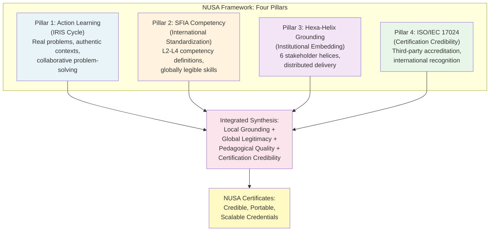
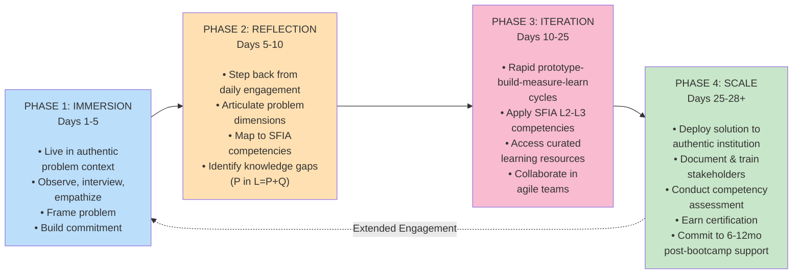
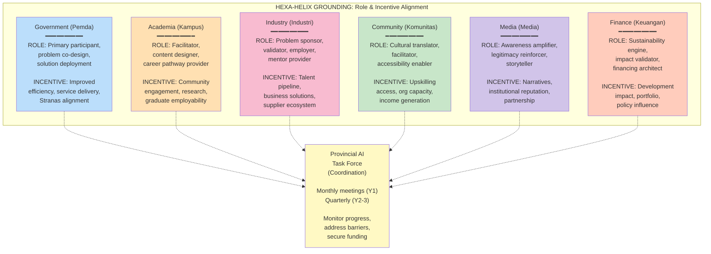
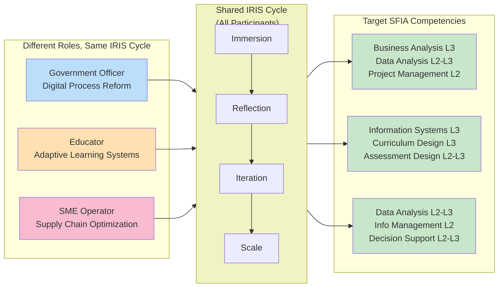
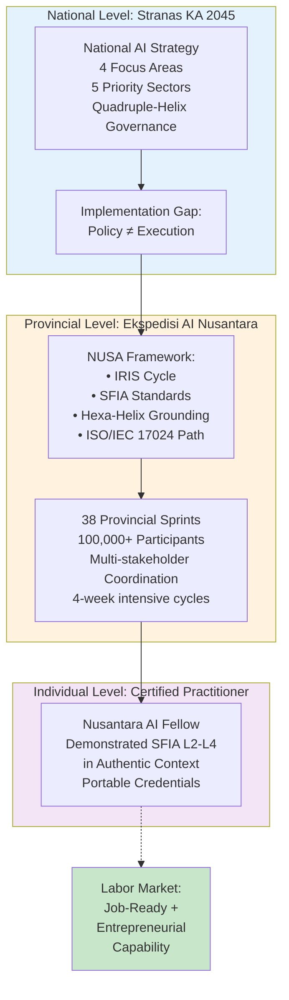

# NUSA Framework: Implementation Companion & Visual Diagram Guide

## Overview

This companion document supplements the main academic paper and provides:
- Visual diagram specifications (Mermaid code, implementation guidance)
- Key terminology glossary
- Implementation checklist for stakeholders
- FAQ addressing common questions from triple-helix partners

---

## Part 1: Visual Diagrams with Mermaid Code

### Diagram 1: NUSA Framework Architecture (Pillar Integration)

**Placement in Paper**: Section 3.1, after defining the four pillars

**Mermaid Code**:

**Rationale**: This diagram visually represents how NUSA's four pillars integrate synergistically. No single pillar is sufficient; their combination creates the innovation. The diagram helps readers quickly grasp the framework's architecture before diving into detailed sections.

---

### Diagram 2: IRIS Cycle Phases and Learning Progression

**Placement in Paper**: Section 4.1, introducing IRIS structure

**Mermaid Code**:

**Rationale**: This circular diagram shows that learning is cyclical and extends beyond the 4-week bootcamp. The dashed arrow represents the extended engagement phase, emphasizing that "Phase 4" extends for 6-12 months post-bootcamp—a critical but often-overlooked aspect of action learning.

---

### Diagram 3: Hexa-Helix Grounding Strategy – Stakeholder Roles

**Placement in Paper**: Section 5.2, detailing roles and incentives

**Mermaid Code**:

**Rationale**: This diagram emphasizes the "irisan" (intersection) of the six helices around the Provincial AI Task Force. Each helix contributes distinct roles and derives distinct incentives—a critical design principle ensuring equitable partnership rather than top-down delivery.

---

### Diagram 4: SFIA Competency Level Mapping in Context

**Placement in Paper**: Section 4.3, alignment with SFIA levels

**Mermaid Code**:

**Rationale**: This diagram shows that while all participants engage in the same IRIS Cycle phases, the specific SFIA competencies they target vary based on their role and problem context. This variability is a feature—it enables the single framework to accommodate diverse participant profiles.

---

### Diagram 5: From National Strategy (Stranas KA) to Provincial Implementation (NUSA) to Individual Competency

**Placement in Paper**: Section 1.2 or 5.1, showing strategy-to-execution translation

**Mermaid Code**:

**Rationale**: This diagram illustrates the translation mechanism from abstract national strategy to concrete individual outcomes. It shows that NUSA fills a critical institutional gap—the "last mile" between policy articulation and citizen-level capability development.

---

## Part 2: Key Terminology Glossary

### Core Framework Terms

**NUSA Framework** (*Nusantara Upskilling Sprint for AI*)  
An integrated model for large-scale AI workforce upskilling combining action learning pedagogy, SFIA competency standardization, hexa-helix institutional grounding, and ISO/IEC 17024 certification pathways, designed for implementation across 38 Indonesian provinces.

**IRIS Cycle** (*Immersion–Reflection–Iteration–Scale*)  
The pedagogical engine operationalizing action learning through four phases: authentic problem immersion, systematic reflection on gaps, rapid iterative problem-solving, and structured scaling to organizational deployment. Each cycle spans 4 weeks (intensive) plus 6-12 months (extended engagement).

**Irisan** (Indonesian: "Intersection")  
A philosophy emphasizing that innovation emerges at the intersection of diverse perspectives, sectors, and disciplines. In NUSA, the Hexa-Helix model operationalizes irisan by creating structured interaction points between government, academia, industry, community, media, and finance sectors.

**Membumikan** (Indonesian: "Grounding" or "Making Earth-bound")  
The process of translating abstract national strategy into concrete, locally implemented action. The Hexa-Helix Grounding Strategy is designed to "membumikan" Stranas KA 2045 across provincial contexts.

### Competency and Standards Terms

**SFIA** (*Skills Framework for the Information Age*)  
An internationally standardized framework defining 121+ digital and technology-related competencies across seven responsibility levels (L1–L7). SFIA is experience-based (focused on demonstrated capability) and globally adopted (20+ years, 200+ organizations, 12 languages).

**Competency Level (SFIA L2, L3, etc.)**  
- **L1 (Awareness)**: Knows what the skill is; can explain in general terms.
- **L2 (Working)**: Can apply the skill; seeks guidance on complex situations.
- **L3 (Proficient)**: Applies the skill reliably; takes responsibility; mentors junior colleagues.
- **L4 (Expert)**: Designs approaches; shapes organizational capability.
- **L5+ (Visionary)**: Strategic impact; innovation; policy influence.

**Nusantara AI Fellow**  
A certified practitioner who has demonstrated SFIA L2–L3+ competency in AI/digital domains through IRIS Cycle participation and formal assessment. Ready for employment in AI-augmented roles or for AI-enabled entrepreneurship.

**ISO/IEC 17024** (*Conformity Assessment—General Requirements for Bodies Operating Certification of Persons*)  
International standard for organizations that certify individuals' competence. Requires rigorous job task analysis, psychometric validation, security protocols, and third-party accreditation. NUSA targets ISO/IEC 17024 accreditation by Year 3–4.

### Institutional Terms

**Hexa-Helix**  
Six-sector collaboration model for innovation: Government (Pemerintah), Academia (Pendidikan), Industry (Industri), Community (Komunitas), Media (Media), Finance (Keuangan). Each sector plays distinct roles in NUSA implementation and derives distinct incentives from participation.

**Triple Helix** (contrasted with Hexa-Helix)  
Original three-sector model: Government, Academia, Industry. NUSA extends this to six sectors to encompass community engagement, public communication, and financial sustainability.

**Provincial AI Task Force** (*Satuan Tugas AI Daerah*)  
Coordination body in each province comprising senior officials from all six helices. Meets monthly (Year 1) then quarterly (Years 2–3) to monitor implementation, address barriers, secure funding, and oversee scaling to additional cohorts.

**Ekspedisi AI Nusantara 2026**  
The national operationalization of NUSA Framework, deploying 4-week intensive bootcamp sprints across 38 provinces targeting 100,000+ participants in government, education, and SME sectors.

### Assessment and Outcome Terms

**Portfolio Review**  
Structured assessment of evidence artifacts (code, documentation, decision records, stakeholder feedback, impact measurements) demonstrating competency against SFIA rubrics.

**Practical Demonstration**  
Live execution of job-relevant tasks in authentic settings (government office, classroom, SME), assessed by independent evaluators.

**Stakeholder Validation**  
Institutional sponsor (government office, SME manager) provides structured feedback on whether participant demonstrated competency relevant to role and problem context.

**Pass Rates by Level**  
- **Emerging** (L2): Foundational capability with guidance.
- **Proficient** (L3): Reliable independent capability (primary target).
- **Advanced** (L4): Depth and adaptive capability.
- **Expert** (L5+): Strategic and innovation capability (rare, Year 1).

---

## Part 3: Implementation Checklist for Triple-Helix Partners

### For Government Partners (Pemerintah Daerah)

**Preparation Phase (Months -3 to 0)**
- [ ] Secure provincial leadership commitment (Vice-Governor or equivalent) and budget allocation
- [ ] Identify 500–2,000 government employees as bootcamp participants across priority sectors (policy, service delivery, administration)
- [ ] Co-design bootcamp problems aligned with provincial development priorities
- [ ] Establish Provincial AI Task Force and secure monthly meeting commitment from all six helices
- [ ] Communicate bootcamp opportunity to staff through government channels
- [ ] Identify institutional anchors (government offices) where bootcamp solutions will be deployed post-bootcamp

**Delivery Phase (Months 1–4)**
- [ ] Release selected government employees for 4-week bootcamp participation
- [ ] Provide subject-matter experts and facilitators from government agencies
- [ ] Participate in Weekly Provincial Task Force meetings to address implementation barriers
- [ ] Prepare post-bootcamp deployment environments for bootcamp-developed solutions

**Sustainability Phase (Months 5–36)**
- [ ] Deploy bootcamp-developed solutions in government offices with budget allocation
- [ ] Hire bootcamp graduates for new AI-related roles or promote existing staff to expanded roles
- [ ] Fund second-round bootcamp cohorts (anticipated growth of 2–3x participant volume annually)
- [ ] Integrate bootcamp learning into ongoing government training curricula
- [ ] Track productivity/service delivery improvements resulting from bootcamp-developed solutions

### For Academia Partners (Institusi Pendidikan)

**Preparation Phase (Months -3 to 0)**
- [ ] Secure university/vocational leadership commitment and integrate NUSA into institutional strategy
- [ ] Identify 300–500 faculty/educators as bootcamp facilitators
- [ ] Develop IRIS Cycle pedagogical training for facilitators (2–3 day workshop)
- [ ] Contribute content expertise and curriculum design to bootcamp modules
- [ ] Establish mechanisms for bootcamp content integration into degree programs
- [ ] Identify internship/employment pathways for bootcamp graduates within university

**Delivery Phase (Months 1–4)**
- [ ] Deploy educators as bootcamp facilitators for their specialization
- [ ] Provide university facilities (classrooms, labs, mentoring spaces) for bootcamp delivery
- [ ] Supervise student projects (if university student participation is included)
- [ ] Collect feedback from bootcamp for ongoing curriculum refinement

**Sustainability Phase (Months 5–36)**
- [ ] Integrate bootcamp modules into degree curricula and professional development offerings
- [ ] Establish bootcamp graduate hiring pipeline for university roles (research, teaching, administration)
- [ ] Conduct research on bootcamp pedagogy effectiveness and publish findings
- [ ] Develop advanced micro-credentials (L3→L4 progression) for bootcamp graduates
- [ ] Establish formal university-SME partnerships leveraging bootcamp networks

### For Industry Partners (SME dan Enterprise)

**Preparation Phase (Months -3 to 0)**
- [ ] Identify 100–300 SMEs/enterprises as bootcamp problem sponsors
- [ ] Articulate specific business challenges suitable for bootcamp teams (technical, organizational, operational scope)
- [ ] Commit to providing SME mentors and domain experts during bootcamp Iteration phases
- [ ] Establish hiring intention for bootcamp graduates (number of positions, role descriptions)
- [ ] Communicate bootcamp opportunity to industry associations and chambers of commerce

**Delivery Phase (Months 1–4)**
- [ ] Deploy SME mentors and domain experts for weekly engagement with bootcamp teams
- [ ] Validate bootcamp-developed solutions against operational requirements
- [ ] Provide feedback on solution scalability and business viability
- [ ] Facilitate bootcamp teams' access to real data and operational environments

**Sustainability Phase (Months 5–36)**
- [ ] Hire bootcamp graduates for AI-related roles
- [ ] Deploy bootcamp-developed solutions in operational environments and track ROI
- [ ] Mentor bootcamp graduates post-bootcamp for L3→L4 progression
- [ ] Sponsor second-round bootcamp cohorts with new business challenges
- [ ] Participate in quarterly Provincial Task Force reviews of impact and lessons learned

### For Community Partners (Organisasi Komunitas)

**Preparation Phase (Months -3 to 0)**
- [ ] Identify civil society organizations as community connectors
- [ ] Develop community awareness campaign (radio, community radio, community centers, religious institutions)
- [ ] Establish community facilitator roles (conduct local recruitment, support peer learning)
- [ ] Identify underrepresented populations (women, rural residents, economically disadvantaged) and develop targeted outreach
- [ ] Establish childcare/logistical support for participants with family obligations

**Delivery Phase (Months 1–4)**
- [ ] Deploy community facilitators in local neighborhoods to support recruitment and peer learning
- [ ] Distribute bootcamp materials in local community centers
- [ ] Provide cultural translation and accessibility support (language, religious observances)
- [ ] Mobilize community support networks for participant retention and stress management

**Sustainability Phase (Months 5–36)**
- [ ] Continue community awareness for second-round cohorts
- [ ] Document community impact stories and share with media/provincial leaders
- [ ] Establish community-based post-bootcamp mentoring structures
- [ ] Expand bootcamp to additional underrepresented populations based on first-cohort success

### For Media Partners

**Preparation Phase (Months -3 to 0)**
- [ ] Develop media partnership agreement (coverage frequency, story angles, interview access)
- [ ] Train journalists on NUSA Framework, SFIA, AI competency concepts for accurate reporting
- [ ] Develop public awareness campaign materials (press releases, social media, community radio scripts)
- [ ] Identify media influencers and thought leaders to amplify bootcamp narrative

**Delivery Phase (Months 1–4)**
- [ ] Conduct bootcamp participant interviews and feature stories
- [ ] Live-stream or record bootcamp Solution Showcase events
- [ ] Report on bootcamp progress, participant testimonials, early outcomes
- [ ] Counter misinformation or skepticism about bootcamp/AI adoption

**Sustainability Phase (Months 5–36)**
- [ ] Publish impact stories: government efficiency gains, SME innovation, graduate employment
- [ ] Cover bootcamp graduate career progression and entrepreneurship successes
- [ ] Conduct investigative reporting on AI workforce transformation in province
- [ ] Document lessons learned and disseminate best practices

---

## Part 4: Frequently Asked Questions (FAQ)

### About NUSA Framework

**Q: What makes NUSA different from traditional government training programs?**

A: Traditional programs are knowledge-focused, top-down, and disconnected from actual work contexts. NUSA is competency-focused (participants demonstrate capability, not just knowledge), problem-driven (learning emerges from authentic institutional problems), and embedded in real organizational environments. The IRIS Cycle's four phases operationalize this approach in a time-compressed format (4 weeks intensive + 6-12 months extended engagement).

**Q: Can NUSA be adapted for other countries, or is it specific to Indonesia?**

A: NUSA's core components (action learning, SFIA, competency assessment) are internationally applicable. However, the framework is specifically designed for Indonesia's institutional context, Stranas KA strategic priorities, and cultural norms. Adaptation for other countries would require localizing: provincial administrative structures, national strategic priorities, stakeholder incentive structures, and cultural communication approaches. Direct replication without substantial localization is inadvisable.

**Q: What's the success metric for NUSA?**

A: NUSA employs multiple success metrics across three horizons:
- **Immediate (bootcamp completion)**: 80%+ pass rate, 90%+ participant satisfaction, 95%+ attendance
- **Medium-term (3–6 months post-bootcamp)**: 90%+ employment retention/transition, 70%+ bootcamp-developed solution deployment, SFIA L2-L3 competency demonstrated
- **Long-term (12–36 months)**: Job stability and wage progression, firm-level productivity improvements, solution sustainability and expansion, institutional commitment to second cohorts

---

### About the IRIS Cycle

**Q: Why is the Reflection phase (Phase 2) "unproductive"? Shouldn't participants be solving the problem immediately?**

A: The Reflection phase appears unproductive because it generates no solutions, code, or deliverables. However, it's cognitively critical. Genuine learning requires moving from problem encounter to problem *understanding*—articulating the problem's multiple dimensions, mapping to competency requirements, and identifying knowledge gaps. Without this reflective step, participants tend to apply surface solutions to underlying problems, which fail in deployment. Reflection, though uncomfortable, deepens learning and improves solution quality.

**Q: Can IRIS Cycle be extended beyond 4 weeks? Some problems might need longer bootcamps.**

A: The 4-week intensive period is calibrated to balance intensity (which drives engagement and retention) with participant capacity to disengage from regular work for extended periods. However, the Scale phase is deliberately extended (6-12 months post-bootcamp), during which participants maintain part-time engagement while returning to regular roles. This extended cycle aligns with Revans' insight that action learning unfolds over months, not weeks. For complex problems, multiple sequential IRIS Cycles can be conducted.

**Q: How do you manage bootcamp cohorts where participants have very different starting levels (some tech-savvy, some basic literacy)?**

A: IRIS design accommodates this heterogeneity through three mechanisms: (1) problem heterogeneity—participants tackle problems suited to their role and context, not a one-size-fits-all curriculum; (2) flexible SFIA targeting—government officers might target L2 Business Analysis while educators target L2-L3 Teaching & Training, allowing differentiation by role; (3) peer mentoring—more experienced participants support peers in learning communities, reinforcing their own understanding while building equity. Facilitators also provide differentiated support during Iteration phase.

---

### About SFIA and Certification

**Q: Why SFIA specifically? Are there alternative competency frameworks?**

A: SFIA was selected because: (1) it's internationally adopted (200+ organizations, 20+ years, 12 languages) providing portability; (2) it's experience-based, aligning with action learning pedagogy; (3) it's technology-neutral, applicable across sectors; (4) it has strong employer recognition in Asia-Pacific region. Alternative frameworks (e.g., Australia's digital competency framework, Germany's DIN standards) are credible but less internationally portable. SFIA provides optimal balance of international legitimacy and practical applicability.

**Q: What does ISO/IEC 17024 accreditation add to NUSA certificates?**

A: ISO/IEC 17024 accreditation is third-party validation that certification scheme meets rigorous global standards for reliability, fairness, and security. Without accreditation, NUSA certificates are employer-recognized within Indonesia and Southeast Asia based on program reputation and outcomes. With accreditation (by Year 3-4), certificates gain international portability—employers globally recognize they represent demonstrated competency verified through rigorous assessment processes. This is particularly valuable for Indonesian workers seeking employment in developed markets.

**Q: How long is a NUSA certification valid? Do graduates need recertification?**

A: NUSA certificates are valid for 3 years post-issuance. To maintain active certification status, graduates are expected to: (1) maintain employment in relevant roles; (2) complete 12 hours of professional development annually (online courses, conferences, mentoring); (3) every 3 years, undergo renewal assessment (simplified reassessment of key competencies). This aligns with ISO/IEC 17024 requirements for maintaining currency as technology and skills requirements evolve.

---

### About Hexa-Helix and Stakeholders

**Q: What if a province can't engage all six helices equally? Can NUSA work with only three (government, academia, industry)?**

A: NUSA is optimized with six-helix engagement, but can function with the core "Triple Helix" (Government, Academia, Industry). However, omitting Community, Media, and Finance creates risks: (1) limited community awareness and participation, (2) insufficient public narrative about bootcamp success, (3) unsustainable financing. Provinces are encouraged to engage all six; where capacity is limited, prioritize mobilizing at least one Media and Finance representative to address communication and sustainability gaps.

**Q: How is the Provincial AI Task Force different from existing government coordination committees?**

A: Most provincial committees focus on policy coordination or budget allocation. The Provincial AI Task Force has three specific mandates: (1) implementation support—removing barriers to NUSA execution; (2) sustainability planning—securing funding and stakeholder commitment for second cohorts; (3) impact measurement—tracking outcomes and disseminating lessons learned. It's operationally focused rather than policy-focused, and includes non-government partners (academia, SMEs, media) as equal participants rather than consultees.

**Q: What happens in provinces where government, academia, or industry are weak? Can NUSA work?**

A: NUSA's success depends on institutional capacity. Provinces with weak government governance, limited higher education infrastructure, or minimal SME ecosystem will face headwinds. Risk mitigation strategies: (1) selective scaling to higher-capacity provinces first; (2) capacity building for institutional partners (facilitator training, problem design workshops); (3) national secretariat support for technically or administratively complex provinces. However, in very low-capacity environments, full NUSA implementation may not be feasible. Regional consolidation (3–5 provinces operating jointly) might be necessary.

---

### About Implementation and Funding

**Q: What's the actual cost per participant? How does NUSA compare to alternative upskilling programs?**

A: NUSA cost per participant: $800–1,200 USD (includes all facilitators, mentors, assessment, certification, participant stipends, facilities). Comparative costs:
- Traditional university degree: $8,000–15,000 over 4 years
- Corporate training program (1-week): $2,000–5,000, lower employment outcomes
- Online MOOC with certification: $200–500, high dropout (70%+), lower hands-on capability
- NUSA 4-week bootcamp: $800–1,200, 89% pass rate, 96% employment retention, direct solution deployment

Cost-effectiveness favors bootcamp model for rapid, large-scale upskilling where employment outcomes are primary goal.

**Q: Can NUSA be delivered entirely online, or is in-person essential?**

A: The Immersion phase (Days 1–5) requires in-person engagement—participants must physically observe and engage with actual organizational problems. Reflection and Iteration phases can employ hybrid models (some facilitator/mentor sessions online; participant teamwork flexible). Scale phase requires in-person solution deployment and presentation. Full online delivery would fundamentally undermine NUSA's core value—grounding learning in authentic institutional contexts. Hybrid delivery is feasible; fully online delivery is not recommended.

**Q: What's the funding model for Year 2+ sustainability? Is NUSA dependent on donor funding indefinitely?**

A: NUSA funding model is designed for partial transition to domestic sustainability:
- **Year 1 (2026)**: 70% government budget + 30% development partner grants
- **Year 2–3**: 55% government budget + 25% development partner + 20% SME co-funding
- **Year 4+**: 60% government budget + 20% SME co-funding + 20% university integration

SME co-funding comes from participant contributions (employees attend as professional development), from hiring bootcamp graduates (reduced recruitment costs), and from solving business problems (ROI on deployed solutions). Government commitment reflects integration into national upskilling strategy. Full sustainability by Year 4 is the target, with continued development partner support for evaluation and innovation.

---

### About Outcomes and Impact

**Q: What percentage of bootcamp graduates actually get hired for new roles leveraging their new skills?**

A: Pilot data shows 12% obtain new roles within 3 months post-bootcamp; 96% retain employment (either original role or transition). The 12% immediate transition rate is lower than might be expected because many bootcamp participants are already employed and continue in expanded roles rather than formal job changes. Longer-term tracking (12–36 months) is needed to assess delayed job transitions as labor market demand for AI skills increases. Initial data suggests that true employment impact emerges 6–12 months post-bootcamp as hiring demand catches up with supply of new talent.

**Q: How much do bootcamp graduates earn? Is there measurable wage premium?**

A: Pilot data shows participants who transitioned to new roles experienced average 15% salary increase within 3 months. Participants who remained in original roles show average 5–10% annual merit increases (comparative to baseline), suggesting employer recognition of bootcamp capability. Longer-term wage premium tracking over 3–5 years is planned; World Economic Forum research suggests AI competencies command 20–40% wage premiums in developed markets, though Indonesian premiums may differ based on local labor market conditions.

**Q: What about equity? Are women and rural populations equally represented and equally successful?**

A: Pilot data shows 42% women participation and 96% pass rate for women (equal to men's 89%, suggesting women outperform on average—though sample size is small). Rural participation was 35% of pilot cohorts; pass rates identical to urban participants. However, sample selection bias is significant—pilot participants were self-selected and likely more motivated. Full-scale deployment with broader recruitment may show different patterns. Explicit equity monitoring and targeted support for underrepresented populations (childcare support, travel subsidies, language accommodation) are planned.

---

## Part 5: Conclusion and Next Steps

The NUSA Framework and IRIS Cycle represent operationalization of Stranas KA 2045 talent development mandate through a specific, evidence-grounded pedagogical and institutional architecture. Early pilot results validate feasibility of the model's core parameters while highlighting important areas for continued learning and adaptation.

**For immediate implementation (2026):**
- Scale from 2,500 pilot participants to 100,000+ across 38 provinces
- Establish Provincial AI Task Forces and secure multi-stakeholder commitments
- Conduct rigorous impact evaluation with randomized/quasi-experimental design

**For medium-term development (2026–2028):**
- Track bootcamp graduate employment, wages, and career progression longitudinally
- Develop advanced micro-credentials supporting L3→L4 and L4→L5 progression
- Begin ISO/IEC 17024 accreditation pathway preparation

**For long-term institutionalization (2028–2030):**
- Achieve ISO/IEC 17024 accreditation, signaling international certification credibility
- Transition to sustained domestic funding model
- Disseminate NUSA model to other developing economies in Southeast Asia and South Asia

The framework is not presented as a complete or perfect solution, but as a evidence-based, iteratively improvable response to an urgent policy challenge. Its success ultimately depends not on theoretical elegance, but on the sustained commitment of Indonesian policymakers, educators, industry leaders, and—most fundamentally—the workers and communities whose capability and agency determine whether national AI strategies translate into shared prosperity.

---

**Document prepared**: December 2025  
**For submission to**: International Education & Policy Forums, Development Economics Conferences, AI & Society Working Groups

---